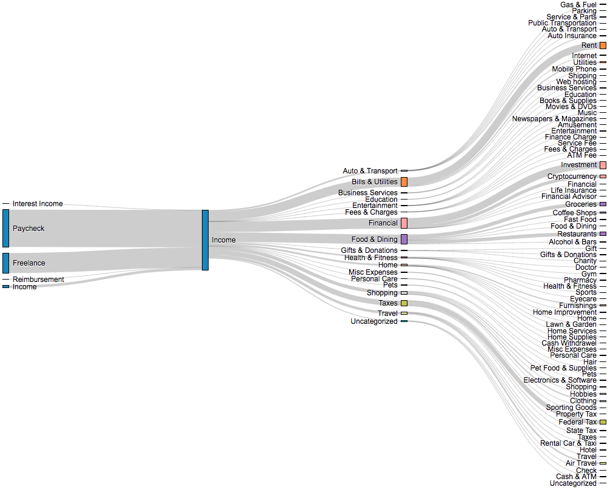

# mint-to-sankey
Quickly convert transactions data from mint into a Sankey chart.

</img>

## Usage

1. Download your Mint transaction data by going to `TRANSACTIONS` and then choosing `Export all xxx transactions` at the bottom right of the listed transactions.
2. [Download](https://github.com/ConstantinoSchillebeeckx/mint-to-sankey/archive/master.zip) this repository.
3. Unzip the repository.
4. Navigate to the unzip directory `mint-to-sankey-master`.
5. Open [index.html](index.html) in your browser, click the `Choose File` button and select the csv you downloaded in step 1.
